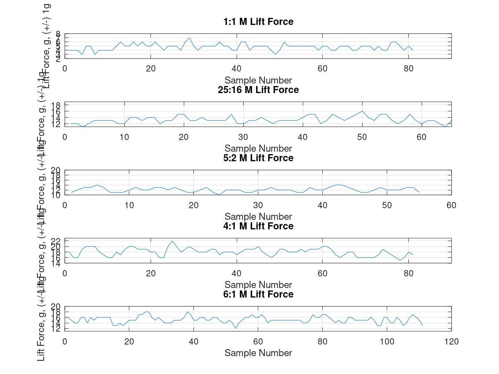
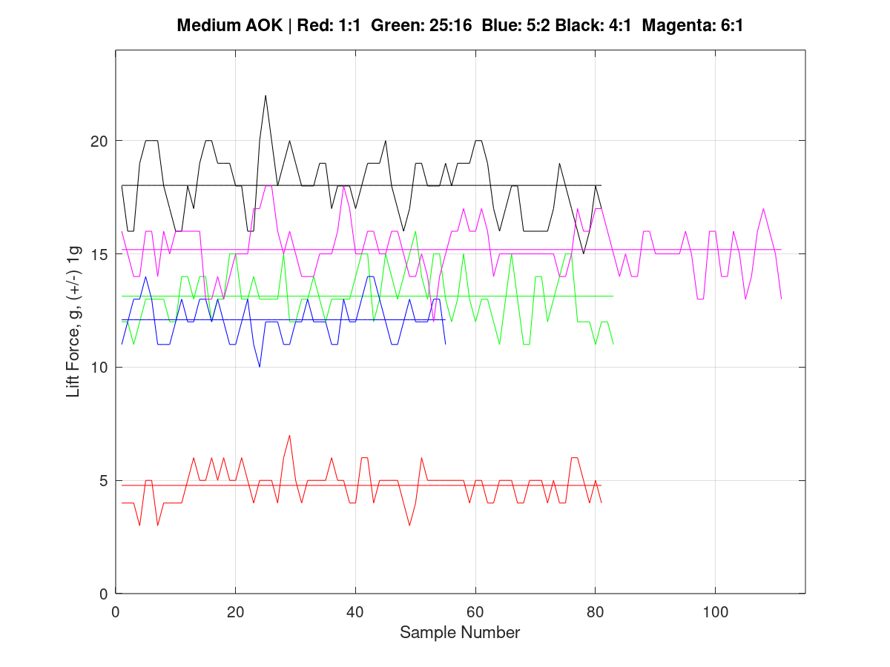
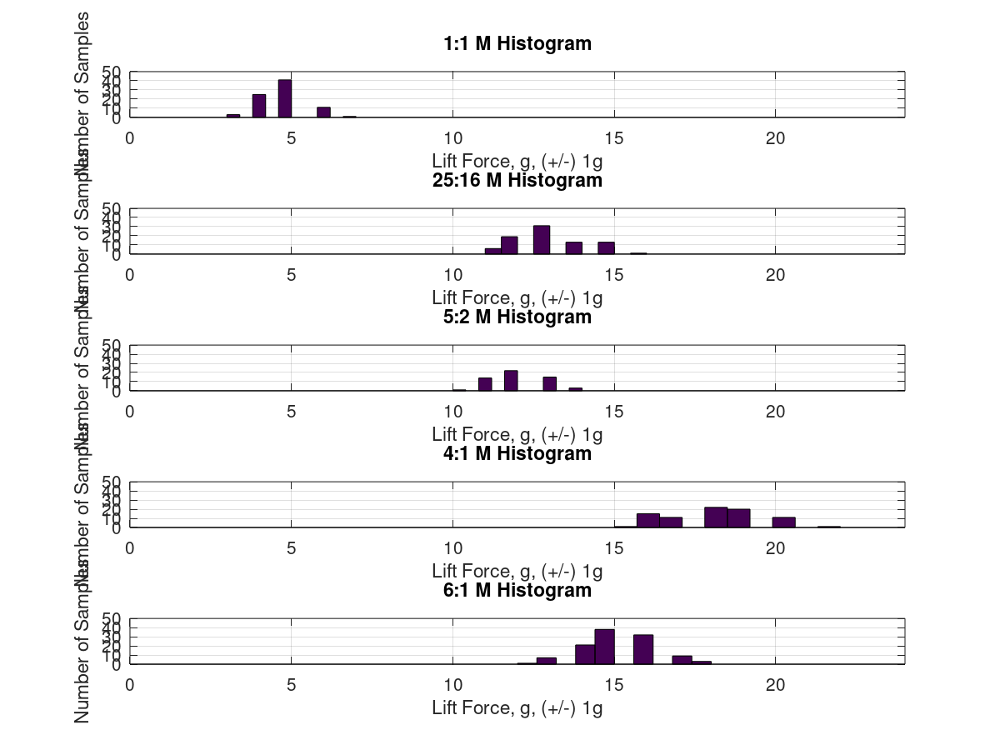
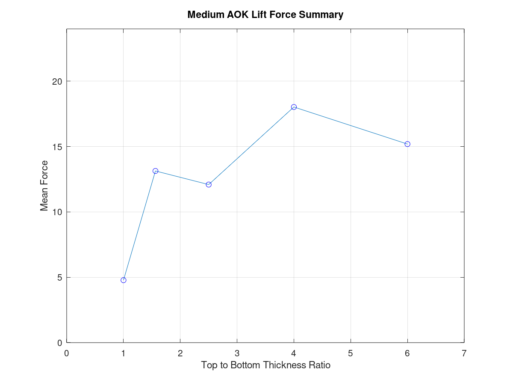

# LiftDataProcessimg Medium Angle of Attack (AOK)

## Purpose

The purpose of this code is to visualize the dataset for every airfoil model umder the Medium AOK.   
Apart from visualizing it, the code also outputs essential information once all the figures are displayed. 

## What the Code Does

This code (not necessarily in this exact order): 

* Takes datafiles for each dataset
* You can set the boundaries (range) of the axes (i.e, the number of true trials, and the y-axis - lift force in this case)
* Figure 1 displays the raw data for each dataset (i.e, each airfoil with a Medium AOK)   
This graph was not included in my Extended Essay as it was uneccesary, but I used it to approximate the data before fully processing it.
* Figure 2 shows the superimposed graphs for each dataset, color-coded. Unfortunately,   
Octave does a poor job at representing different types of lines, so in this case (with 5 different lines),   
color-coding was essential
* Figure 3 shows histograms for each airfoil model with the same axes to make it comparable.   
I did not include this in my final Extended Essay as I found it unnecessary, but it's a good way to visualize the data. 
* Figure 4 puts the mean averages of each airfoil's dataset vs. it's thickness ratio (in decimal form), showing a nice  
summary for the Medium AOK.
* A final text summary is outputted, showing the *mean force*, *standard deviation*, and *signal-to-noise ratio (SNR)*,  
which is essentially the mean value divided by the stnadard deviation. These values help to show the quality of the measurements. 

 
 

 
*Figure 1*   

 
*Figure 2*  

 
*Figure 3*  

 
*Figure 4*  

 
*Figure 5: text summary*  

## Make it Your Own

This code is best for visualizing the a dataset in different ways, but would have to be modified a substantial amount   
in order to make adjustments to another setting. In any case, sections are labelled with comments for easy editing. 
