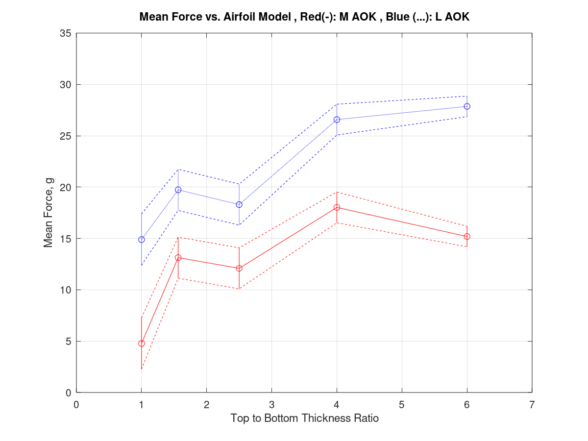

# LiftDataProcessing Analysis Octave Code

## Purpose

This code uses the mean lift data from every different airfoil model and angle of attack (AOK),    
and displays them together with an uncertainty for each point. This uncertainty is derived from the apparent    
range of each value, as several runs indicated.     
Curiously, the range for a lower top-to-bottom thickness ratio is larger that that of the larger ratios.    

## What the Code Does

This code:

* Uses 2 sets of 5 values (one for each AOK) and graphs them (superimposed) on a single figure. 
* It connects these values with a line, as well as showing the individual values with an 'o'. 
* After that, an uncertainty value is declared for each value, which is graphed using a vertical line both above and below the point. 
* Finally, these uncertainty lines are connected with a dotted line, showing the possible values for each value and dataset in a neat manner.

Here is the figure resulting from this code for my particular dataset:

 
*LiftDataProcessingA Outputted Figure*  

## Make it Your Own

Needless to say, this code is best used for the comparison between two datasets including their uncertanties.       
Using the .m files, you can look over and modify the amount of datasets, axes, uncertainty values, etc. to fit your needs.    
Everything is outlined as clearly as possible for an easier maneuvering and modification of the code.