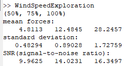

# WindSpeedExploration Octave Code

## Purpose 

The purpose of this exploration is to determine what motor load creates the most   optimal results, which will determine the motor load used for the actual   measurements.   
The code for this experiment will process the lift force the airfoil produces    depending on the motor load, which is recorded using Tera Term and saved as a    no-extension file.   

## What the Code Does

The code will take the three different files and:
- Make a graph showing the raw data for each dataset
- Graph a second plot with superimposed color-coded datasets, which includes the wanted values of each dataset with their mean lines. This allows for visual comparison of each run. 
- Make a final figure which includes the histograms (how many times each value was recorded) of each runthrough with comparable axes.
- Finally, it will display an output message containing the mean average, standard deviation, and SNR (signal-to-noise ratio) for every motor load.    

 
*Figure 1: Raw Data*  

 
*Figure 2: Superimposed Processed Data*  

 
*Figure 3: Histograms*  

 
*Figure 4: summary message*   

## Make it Your Own

This code is best for comparing 3 datasets in many ways, both visual and textual.    
The .m file has comment notes on it to facilitates use if it were to be modified or used by somebody else,   
so feel free to do so.

