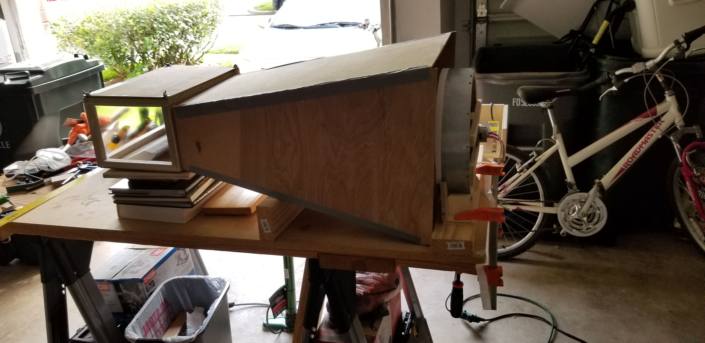
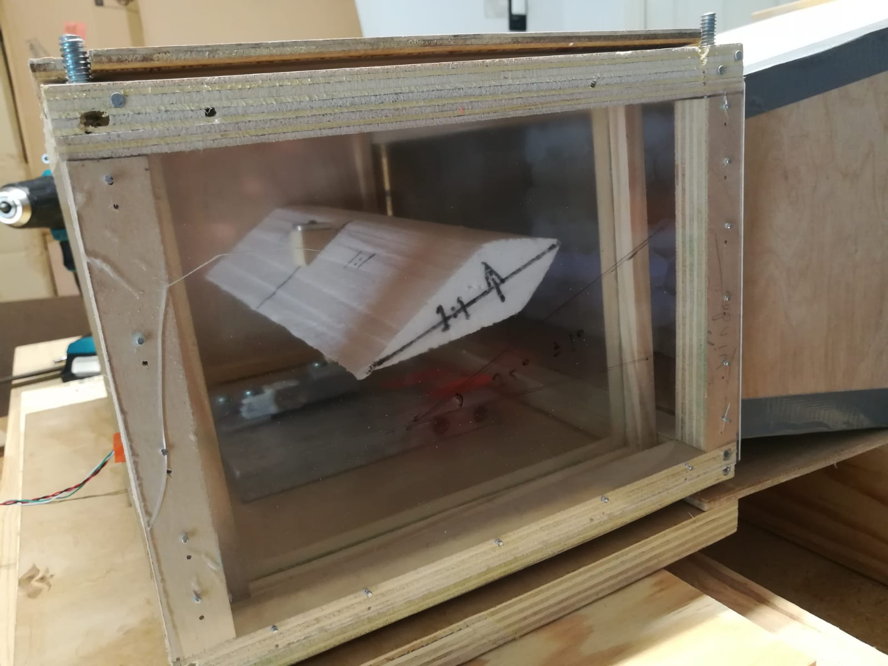
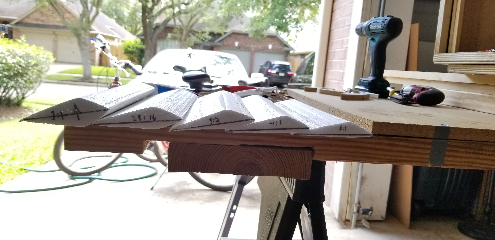
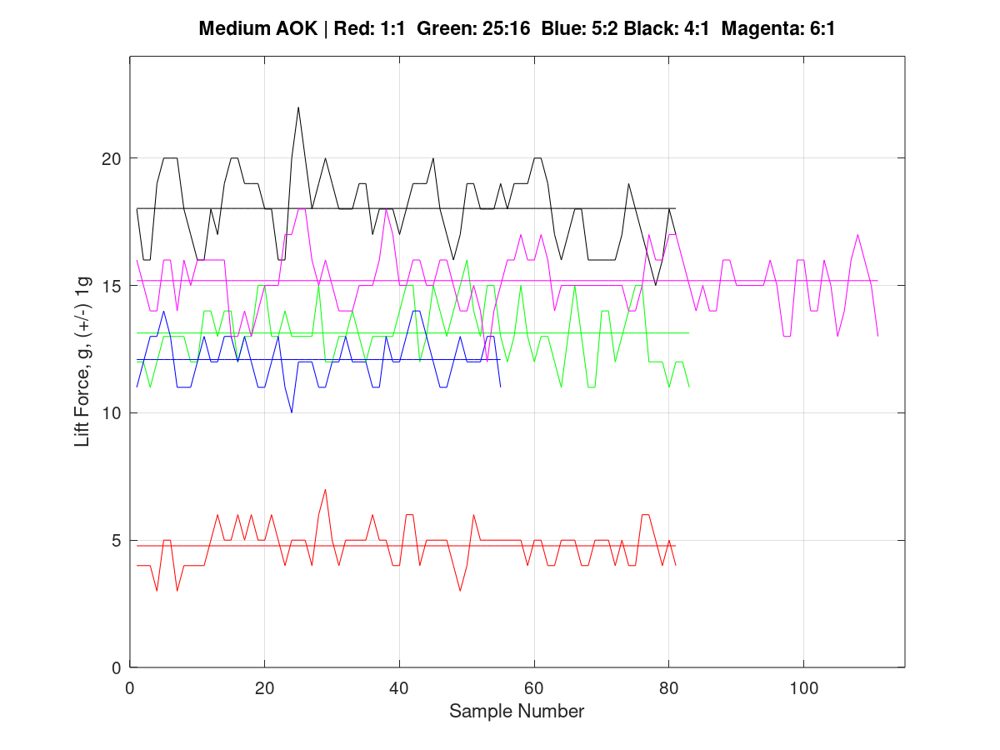
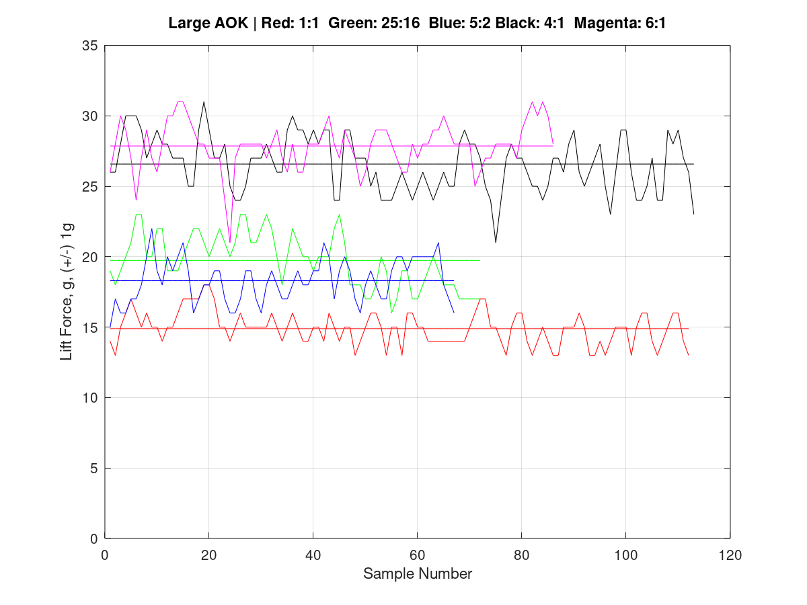
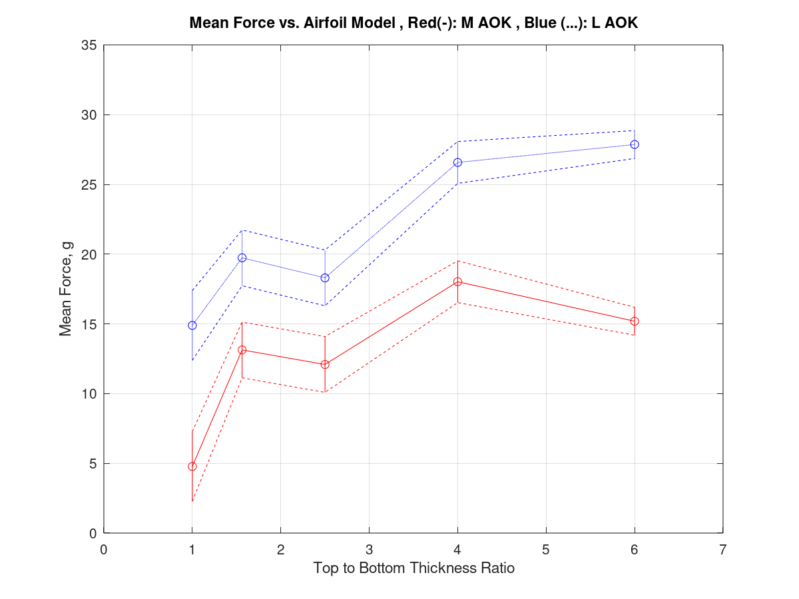

# AIRFOIL_LIFT_STUDY

## What is it?

This code is the one I used and/or created for my International Baccalaureate Extended Essay in Physics, where I   
compare the lift force of an airfoil depending on the ratio between its top and bottom thicknesses, relative to the chord.   
It was a very interesting project, and a good way for me to learn/imporve on my Octave scripting, as it's a very powerful tool I want to use in future projects.
The PDF attached is a copy of my Extended Essay, and the photos below show some of the physical experimental setup leading to the taken measurements. The diagrams below that show some of the Octave-processed data representing the key outcomes of my experimentation.  
<b>code overview/description below visuals</b>
  

 
*Image 1: Full Experimental Setup*  

 
*Image 2: Test Chamber*  

 
*Image 3: Cut Out Airfoils*  

 
*Figure 1: Medium Angle of Attack Lift Force Data With Mean Lines*  

 
*Figure 2: Large Angle of Attack Lift Force Data With Mean Lines*  

 
*Figure 3: Summary Lift Force vs. Thicnkenss Ratio of Both AOKs*  

## The Code
### Arduino IDE (Integrated Development Environment)
For this project, I used an Arduino Uno, so I used a [pre-existing code](https://circuits4you.com/2016/11/25/hx711-arduino-load-cell/) and modified it to my needs. I am not very strong in Arduino yet, so this was the most effective solution, but I'm hoping to improve through other projects, as Arduino is a great tool for many different types of projects. 

### Octave Scripting
Apart from Arduino IDE code, I also used the multi-tool scripting software Octave, which I used to visualize and process my data. For this code, I learned with the help of my father, and then wrote many different version of the code until it fit my needs and outputted a good result. 

## Other 
If you are interested in this project, you can [watch this video](https://www.youtube.com/watch?v=vjzbLZjJvRk&feature=youtu.be) where I outline and explain my processing and analysis. 